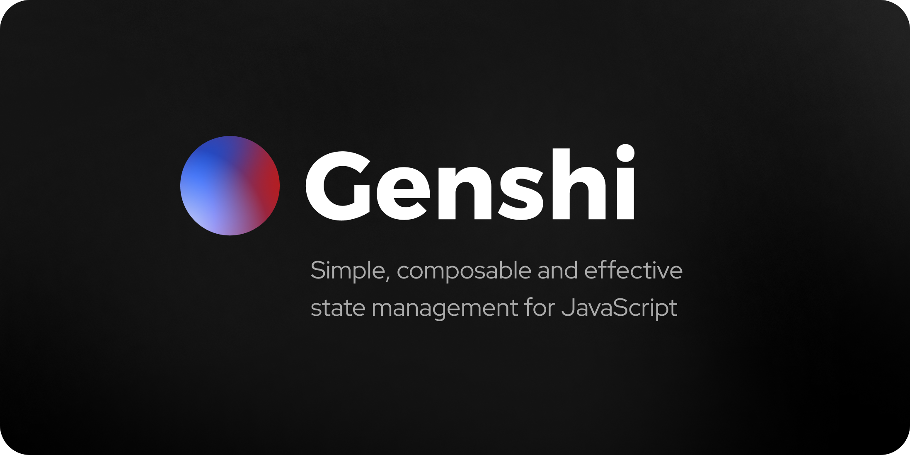

Genshi is a state management library for JavaScript that focuses on being simple, effective and composable. It is designed to be easy to use and understand, while providing the flexibility and power needed to build complex applications.

To learn more about Genshi's motivation and core concepts, check out the following docs:
- [Introduction to Genshi](https://genshi.samrith.dev/project/introduction/)
- [Core concepts](https://genshi.samrith.dev/project/core-concepts/)

Genshi is available for React via an official adapter. But you can just as easily use it with any JavaScript library or framework.
- [Using with React](https://genshi.samrith.dev/guides/using-with-react/)
- [Using with other libraries](https://genshi.samrith.dev/guides/using-with-other-libraries/)

Genshi has two major packages, for which you can find the relevant API reference on the website:
- [`@genshi/core`](https://genshi.samrith.dev/reference/package-core/) - The core package which can be integrated with any JavaScript library
- [`@genshi/react`](https://genshi.samrith.dev/reference/package-react/) - The official adapter to use Genshi with a React app

Explore [the website](https://genshi.samrith.dev) for full documentation and guides!

