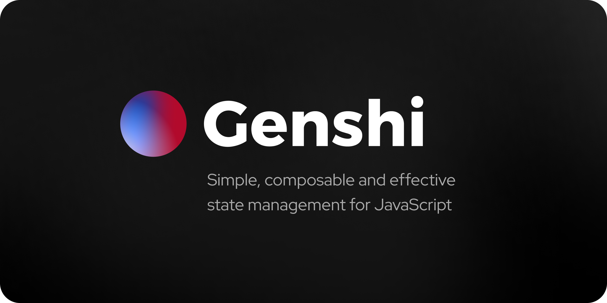

## Motivation

There are a LOT of really amazing state management libraries out there, which have been built over many years. They all have amazing communities and resources out there to help developers achieve their goals.

But.. what if I want something simpler? In this crowded space, [Zustand](https://github.com/pmndrs/zustand) stood out because of how simple and easy it was. No need of other complexities. Just let me manage my state, the way I want to - which is also why a lot of developers are also content using native solutions provided by libraries themselves (ex. `useReducer`).

As more of our frontend code moves to server-side rendering or server-driven content, it makes even more sense to make store management simpler and easier.

Another common problem which a lot of developers echo, is that with a lot of UI libraries/frameworks, there is no distinctly clear way to segregate you code. You can easily mix side effects and state updates.

## Introducing - Genshi

Genshi is built to be extremely lightweight (~2.5kb gzipped), but provide you the ability to manage state for simple counters to rich text notes.

Genshi is inspired by the [Elm architecture](https://guide.elm-lang.org/architecture/), and focuses on two major things:

- **Actions:** which directly update your application state
- **Effects:** which encapsulate side-effects like API calls, logging and other asynchronous operations

## Project structure

This project (as of now) consists of two packages:

- **[@genshi/core](https://github.com/samrith-s/genshi/tree/main/packages/core):** Which provides the entire functionality of Genshi in one package
- **[@genshi/react](https://github.com/samrith-s/genshi/tree/main/packages/react):** The adapter for React which has a slim binding on top of `@genshi/core` to provide interoperability with React

## Core API

As a runtime consumable, Genshi exposes only ONE export - the `Store` class.

### Usage with React

To get started, install the React adapter:

```bash
npm i @genshi/react
```

Now, you can create your store and the actions and effects.

```ts
import { createStore } from "@genshi/react";

export const [useStore, store] = createStore(0);

export const increment = store.action("increment", ({ state }) => state++);

export const tick = store.effect("tick", ({ dispatch }) => {
  dispatch(increment);
});
```

And in your component:

```tsx
import { useStore, increment, tick } from "./store";

function Counter() {
  const [count, dispatch] = useStore((s) => s);

  useEffect(() => {
    dispatch(tick);
  }, []);

  return (
    <>
      <button
        onClick={() => {
          dispatch(increment);
        }}
      >
        Increment
      </button>
      <p>The count is: {count}</p>
    </>
  );
}
```

## Usage with other JavaScript frameworks or libraries

Since Genshi is made using pure JavaScript, you can directly consume the `@genshi/core` package to consume it however you see fit.

The store we created above can just as easily be used in any other flavour.
